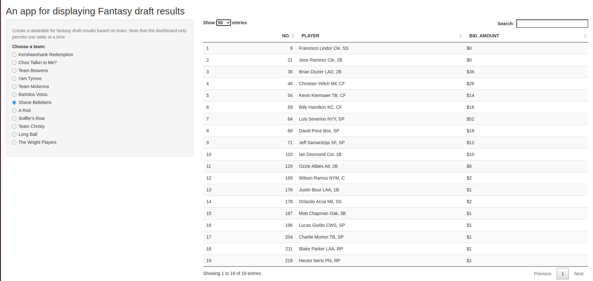

#  Fantasy Baseball Draft Recap Shiny Application
A shiny application I created to store and display the draft results for my 2019 fantasy baseball league.
The app was a small project produced for a R studio internship application.


## Project Organization 
The Data/ directory contains a .Rmd file in which I cleaned the html data and transformed 
it into a format that was acceptable for presenting in tables. 

In the root directory the app.R file contains the actual code for the Shiny application.

## Installation 
Assuming you have Git on your system in the terminal run.  


```bash
git clone https://github.com/abernauer/Shiny_Fantasy_App.git
```  


## Usage

Assuming you have the Rstudio ide installed open the project you just cloned.
After opening the project within Rstudio click the ui button on the App.R file labeled run app.

The app should look like this 


## Resources
For more info on [shiny](http://shiny.rstudio.com/).
